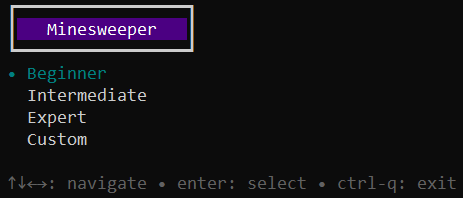
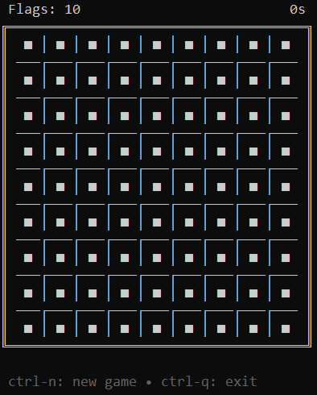
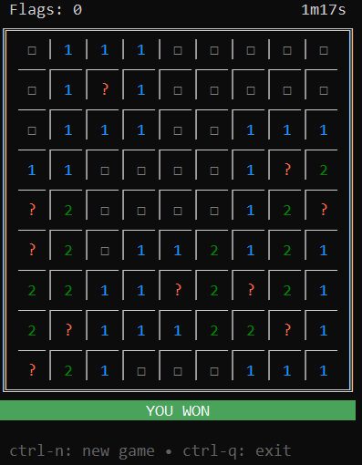

<H1>GO MINESWEEPER</H1>
<ul>
    <li>Minesweeper engine</li>
    <li>command prompt implementation</li>
    <li>mouse controlled console implementation, powered by <a href="https://github.com/charmbracelet/bubbletea">Bubble Tea</a>, <a href="https://github.com/lrstanley/bubblezone">BubbleZone</a>, <a href="https://github.com/charmbracelet/bubbles">Bubbles</a> & <a href="https://github.com/charmbracelet/lipgloss">Lip Gloss</a></li>
</ul>

    
    

